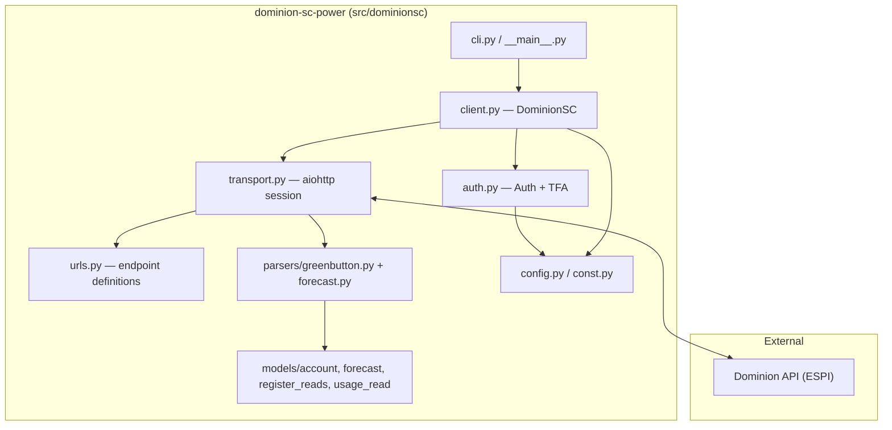

# Dominion SC Power — Architecture Overview

## Project Identity

- **Name:** `dominion-sc-power`
- **Purpose:** Python library for Dominion Energy South Carolina customers to retrieve historical and forecasted energy usage and cost data.
- **Consumer:** Home Assistant integration (`ha-dominion-sc`).
- **Repo:** `github.com/sctigercat1/dominion-sc-power`

## Scope & Boundaries

- **In scope:** Async `aiohttp` client; login + TFA; usage/cost retrieval by register (`ESPI UsagePoint`); forecast model; CSV/CLI output; multi-meter-netting support.
- **Explicit limits (from README):** One service address per account; TFA required; data delayed 24–48 hours.

## High-Level Component Diagram

## Key Design Decisions (Grounded)

- **Async/await** using `aiohttp` (`client.py`, `auth.py`, `transport.py`).
- **Cookie jar** (`create_cookie_jar`) for session persistence.
- **Parser separation:** `parsers/greenbutton.py` for historical usage; `parsers/forecast.py` for bill forecasts.
- **Register-level reads:** `register_reads.py` distinguishes grid-delivery vs solar-export (negative values) via `UsagePoint` id.
- **CLI extracted** from `__main__.py` into `cli.py` (see `REFACTOR_PLAN.md` Phase 5, finding F9 fix).

## Technology Stack

- Python 3.11+; `aiohttp`; `uv`/`pyproject.toml`; `pytest`; `ruff`; GitHub Actions (`lint.yml`, `test.yaml`, `python-publish.yaml`).
