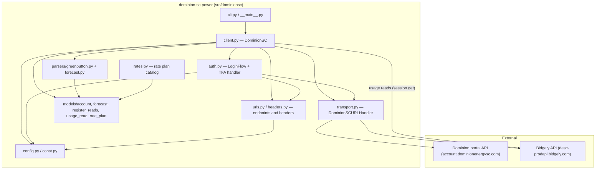

# Dominion SC Power — Architecture Overview

## Project Identity

- **Name:** `dominion-sc-power`
- **Purpose:** Python library for Dominion Energy South Carolina customers to retrieve historical and forecasted energy usage and cost data.
- **Consumer:** Home Assistant integration (`ha-dominion-sc`).
- **Repo:** `github.com/sctigercat1/dominion-sc-power`

## Scope & Boundaries

- **In scope:** Async `aiohttp` client; login + TFA; usage/cost retrieval by register (`ESPI UsagePoint`); forecast model; CSV/CLI output; net-metered (multi-register) solar accounts; a declarative residential rate plan catalog with superseded tariff periods (`rates.py`).
- **Explicit limits (from README):** One service address per account; TFA required; data delayed 24–48 hours.

## High-Level Component Diagram

The library talks to two external systems: the Dominion customer portal (login, account, forecast) and Bidgely (the analytics platform that stores and serves the metering data).

## Key Design Decisions (Grounded)

- **Async/await** using `aiohttp` (`client.py`, `auth.py`, `transport.py`). The caller owns the `aiohttp.ClientSession`; the library never closes it or changes its default headers.
- **Cookie jar** (`create_cookie_jar`, in `helpers.py`) with `quote_cookie=False`, so Dominion's session cookies are stored and resent exactly as the server sent them.
- **Two backends:** Dominion's portal handles authentication, account data, and forecasts; Bidgely serves the interval metering data. Login bridges the two by exchanging a Dominion-issued encrypted token for a Bidgely bearer token.
- **Parser separation:** `parsers/greenbutton.py` for historical usage; `parsers/forecast.py` for bill forecasts. Both are pure functions with no network access.
- **Register-level reads:** `register_reads.py` keeps readings for each physical meter register separate, keyed by ESPI `UsagePoint` id. A solar-export register may carry negative values, but Dominion does not reliably report flow direction, so consumers decide how to interpret each register.
- **Consumption scaling:** the Green Button parser applies the feed's declared `powerOfTenMultiplier` so gas values come out in cubic feet.
- **Single source of truth for configuration:** `UtilityConfig` (`config.py`) carries endpoints, timezone, pilot ID, and User-Agent; `urls.py` and `headers.py` are the only places that build URLs and header dicts.
- **CLI extracted** from `__main__.py` into `cli.py` (see `REFACTOR_PLAN.md` Phase 5, finding F9 fix).
- **Rate plans as data:** `rates.py` declares the residential tariff catalog using a discriminated union of frozen charge dataclasses (`models/rate_plan.py`) rather than parsed/fetched data — no network call is involved. Superseded tariff periods (for example `RATE_8_2025`) are kept alongside the current plans so callers can price historical usage with `get_rate_plan_for_date()`.

## Technology Stack

- Python 3.11+; `aiohttp`; `xmltodict`; `tzdata`; `uv`/`pyproject.toml` (setuptools build backend); `pytest`; `ruff`; GitHub Actions (`lint.yml`, `test.yaml`, `python-publish.yaml`).
