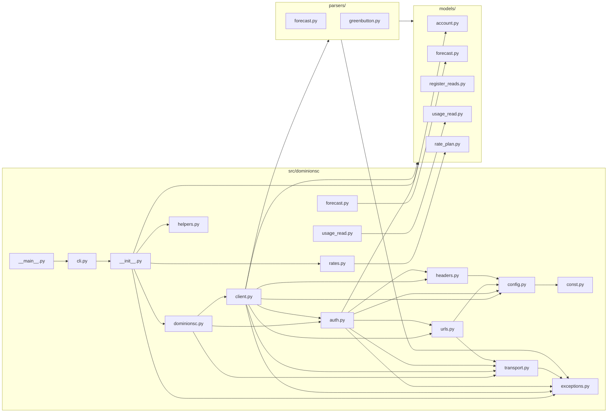

# Component & Package Architecture

## Package Structure (Grounded in `src/dominionsc/`)

```text
src/dominionsc/
  __init__.py          # public API: DominionSC, exceptions, models, rate plans and lookups, create_cookie_jar
  py.typed             # PEP 561 marker (inline type information)
  dominionsc.py        # backward-compatible import path (re-exports DominionSC, DominionSCTFAHandler, DominionSCURLHandler)
  auth.py              # login sequence (LoginFlow), verification-token scraping, TFA handler
  client.py            # DominionSC class
  cli.py               # argparse + CSV output
  transport.py         # DominionSCURLHandler (aiohttp request wrapper) and cache_buster()
  urls.py              # endpoint URL construction
  headers.py           # HTTP header helpers
  config.py            # UtilityConfig (endpoints, timezone, pilot ID, User-Agent) and DEFAULT_CONFIG
  const.py             # constants (USER_AGENT, BIDGELY_PILOT_ID)
  exceptions.py        # InvalidAuth, MfaChallenge, etc.
  forecast.py          # backward-compatible re-export of models.forecast.Forecast
  helpers.py           # create_cookie_jar()
  usage_read.py        # backward-compatible re-export of models.usage_read.UsageRead
  rates.py             # declarative residential rate plan catalog, including superseded tariff periods
  __main__.py          # entry point delegating to cli.main()

  models/
    account.py         # AccountInfo / account model
    forecast.py        # Forecast model
    register_reads.py  # Per-register read model
    usage_read.py      # Usage read model
    rate_plan.py       # RatePlan type system (discriminated Charge union)
    __init__.py

  parsers/
    forecast.py        # Forecast parser
    greenbutton.py     # ESPI greenbutton XML parser
    __init__.py
```

## Package Diagram

Arrows show imports.



## Component Responsibilities

| Component | Key Symbol / Class | Responsibility |
| --- | --- | --- |
| `auth.py` | `LoginFlow`, `DominionSCTFAHandler`, `find_verification_token()` | Multi-step Dominion + Bidgely login, CSRF verification-token extraction, and the interactive TFA flow (options, code delivery, code verification). Session cookies are held by the caller's `aiohttp` session, not by this module |
| `client.py` | `DominionSC` | Main API facade; async methods (`async_login`, `async_get_accounts`, `async_get_forecast`, `async_get_register_reads`, `async_get_usage_reads`) |
| `cli.py` | `build_parser()`, `run()`, `main()` | Argument parsing; CSV output; loop over accounts |
| `transport.py` | `DominionSCURLHandler`, `cache_buster()` | Wraps a caller-supplied `aiohttp.ClientSession` for GET/POST with a 30-second default timeout and converts `ClientError` into `CannotConnect` |
| `urls.py` | URL builder functions | Endpoint paths for login, account, forecast, and Bidgely (`wc-session`, `gb-download`) endpoints |
| `headers.py` | Header builder functions | Fresh header dicts for Dominion page/AJAX calls and Bidgely calls; the only place the Bidgely pilot ID header is set |
| `config.py` / `const.py` | `UtilityConfig`, `DEFAULT_CONFIG`, `USER_AGENT`, `BIDGELY_PILOT_ID` | Endpoints, timezone, pilot ID, and User-Agent in one place |
| `exceptions.py` | `CannotConnect`, `InvalidAuth`, `MfaChallenge`, `ApiException` | Exception hierarchy; `CannotConnect` and `ApiException` carry `url`, `status`, and `response_text` |
| `helpers.py` | `create_cookie_jar()` | Cookie jar that does not percent-encode Dominion's cookie values |
| `parsers/greenbutton.py` | `parse_registers()`, `parse_usage_reads()` | Parses ESPI `UsagePoint` XML into register-level reads, applying the feed's `powerOfTenMultiplier` scaling |
| `parsers/forecast.py` | `parse_forecast()` | Parses forecast responses into cost/projections |
| `models/` | Dataclasses | Structured output (`AccountInfo`, `RegisterReads`, `UsageRead`, `Forecast`, `RatePlan`) |
| `rates.py` | `RATE_1`...`RATE_8`, `RATE_32S`, `RATE_32V`, `RATE_6_2025`, `RATE_8_2025`, `RATE_PLAN_HISTORY`, `get_rate_plan()`, `get_rate_plan_history()`, `get_rate_plan_for_date()` | Declarative, hard-coded residential tariff catalog (current plans plus superseded periods); no network calls |
| `models/rate_plan.py` | `RatePlan`, `Charge` union | Discriminated-union type system (`DailyCharge`, `TieredUsageCharge`, `TimeOfUseCharge`, `DemandCharge`, etc.) backing the rate catalog |
