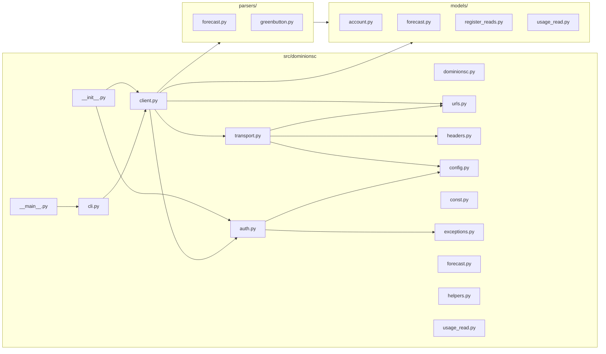

# Component & Package Architecture

## Package Structure (Grounded in `src/dominionsc/`)

```text
src/dominionsc/
  __init__.py          # exports DominionSC, exception types, create_cookie_jar
  dominionsc.py        # thin module-level wrapper
  auth.py              # login, TFA, cookie session (11,704 bytes)
  client.py            # DominionSC class (11,704 bytes)
  cli.py               # argparse + CSV output (7,863 bytes)
  transport.py         # aiohttp session and request building (2,614 bytes)
  urls.py              # endpoint URL construction (3,456 bytes)
  headers.py           # HTTP header helpers (1,914 bytes)
  config.py            # configuration / env helpers (572 bytes)
  const.py             # constants (930 bytes)
  exceptions.py        # InvalidAuth, MfaChallenge, etc. (1,834 bytes)
  forecast.py          # forecast data helper (317 bytes)
  helpers.py           # utility functions (191 bytes)
  usage_read.py        # usage read helpers (327 bytes)
  __main__.py          # entry point delegating to cli.run()

  models/
    account.py         # AccountInfo / account model (1,632 bytes)
    forecast.py        # Forecast model (425 bytes)
    register_reads.py  # Per-register read model (1,682 bytes)
    usage_read.py      # Usage read model (355 bytes)
    __init__.py

  parsers/
    forecast.py        # Forecast parser (1,813 bytes)
    greenbutton.py     # ESPI greenbutton XML parser (6,498 bytes)
    __init__.py
```

## Package Diagram



## Component Responsibilities

| Component | Key Symbol / Class | Responsibility |
| --- | --- | --- |
| `auth.py` | `auth_login()`, TFA challenge handlers | Authentication, 2FA, cookie jar persistence |
| `client.py` | `DominionSC` | Main API facade; async methods (`async_get_usage_reads`, `async_get_accounts`, etc.) |
| `cli.py` | `build_parser()`, `run()` | Argument parsing; CSV output; loop over accounts |
| `transport.py` | Session wrapper | `aiohttp.ClientSession`; request/response handling |
| `urls.py` | URL builder functions | Endpoint paths for usage, forecast, account endpoints |
| `parsers/greenbutton.py` | XML parser | Parses ESPI `UsagePoint` XML into register-level reads |
| `parsers/forecast.py` | Forecast parser | Parses forecast responses into cost/projections |
| `models/` | Data classes / typed dicts | Structured output (`AccountInfo`, `UsagePoint` reads, forecasts) |
