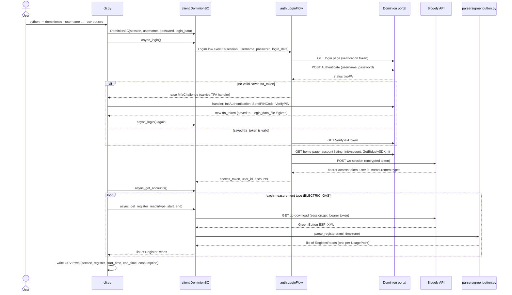
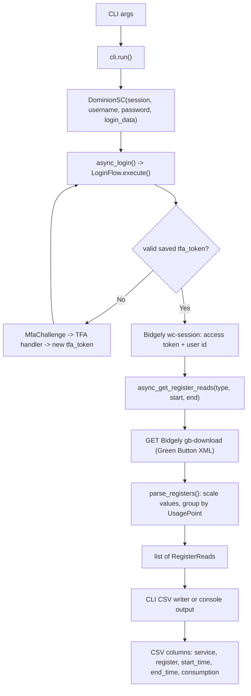

# Data Flow & Sequence Architecture

## Request Sequence (CLI -> APIs -> Parser -> CSV)

This is the flow for `python -m dominionsc --csv output.csv`. Without `--csv`, the CLI also fetches and prints the forecast and prints readings to the console instead of writing a file.

All Dominion and Bidgely login and forecast calls go through `DominionSCURLHandler.call_api()` in `transport.py`. Usage reads (`gb-download`) call `session.get` directly, a known inconsistency documented in `transport.py` and the developer guide.

## Data Flow Diagram (Flowchart)

## Response Parsing Flow (Grounded)

- **Historical:** `parsers/greenbutton.py` parses ESPI XML. Registers are separated by `UsagePoint` id (see `register_reads.py`) and returned in first-seen order. Negative values are preserved (a solar-export register may report them). Raw values are multiplied by the feed's declared `powerOfTenMultiplier` (`10 ** multiplier`), which is what converts Dominion's gas readings to cubic feet; electric feeds declare none.
- **Forecast:** `DominionSC.async_get_forecast()` fetches the portal home page (for a fresh verification token), then the `GetAccountAMIUsageAlerts` endpoint; `parsers/forecast.py` turns the JSON into a `Forecast` (`models/forecast.py`).
