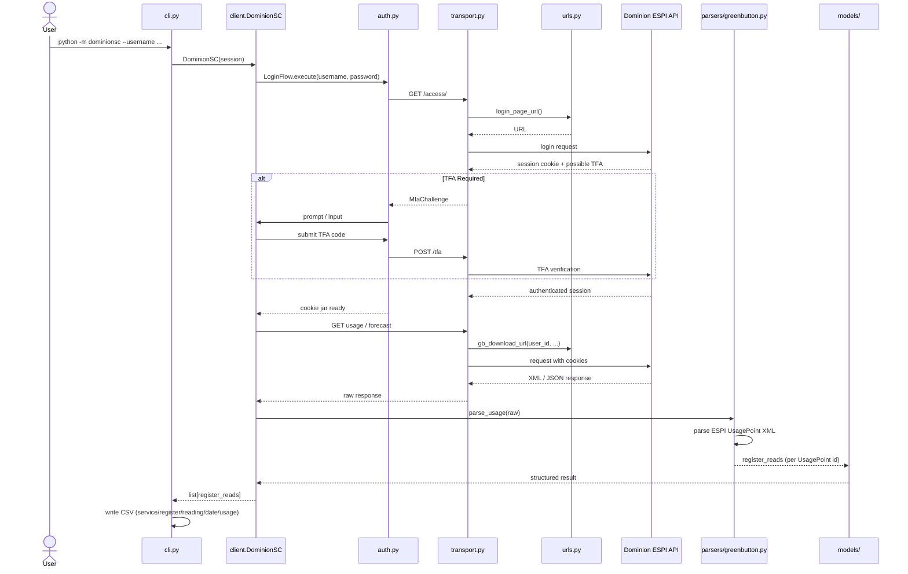
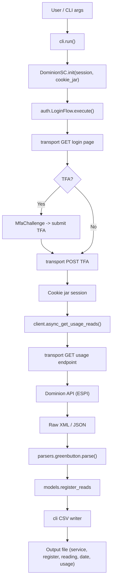

# Data Flow & Sequence Architecture

## Request Sequence (CLI -> API -> Parser -> CSV)

## Data Flow Diagram (Flowchart)

## Response Parsing Flow (Grounded)

- **Historical:** `parsers/greenbutton.py` parses ESPI XML. Registers separated by `UsagePoint` id (see `register_reads.py`). Negative values preserved for solar export.
- **Forecast:** `parsers/forecast.py` parses forecast endpoint into cost projections (`models/forecast.py`).
