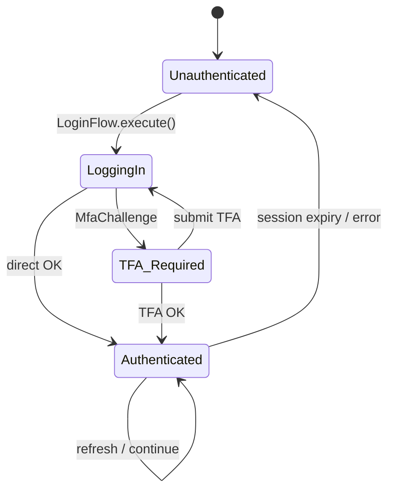
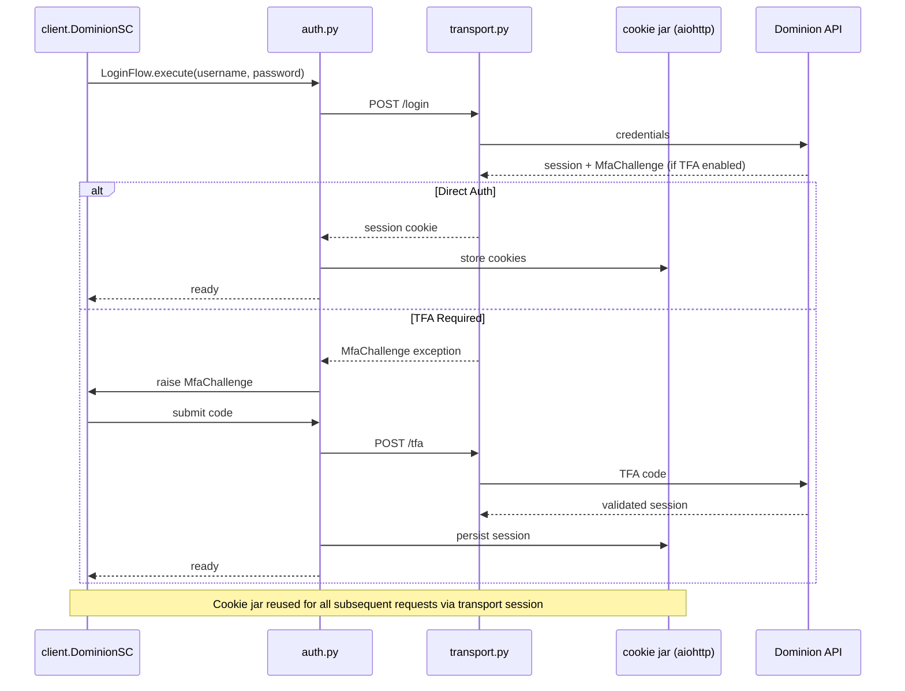
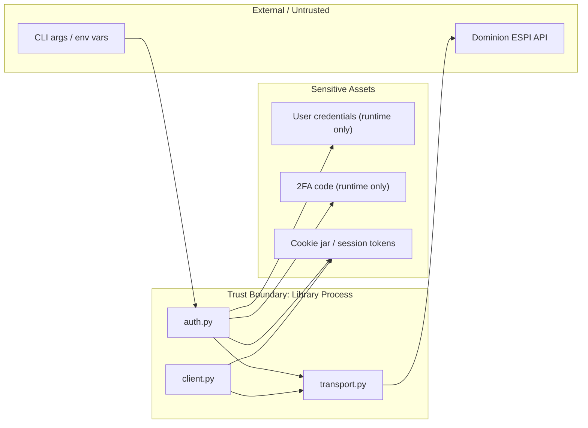

# Security & Authentication Architecture

## Authentication State Machine

## Auth Flow Sequence (Security-Focused)

## Security Boundaries & Sensitive Assets

- **Secrets:** Password / TFA code passed through `auth.py`; never stored in source or config files (only env/args at runtime).
- **Session:** `create_cookie_jar()` in `__init__.py`; session cookies handled by `aiohttp.ClientSession` via `transport.py`.
- **Transport:** HTTPS only to Dominion endpoints; `urls.py` defines secure endpoints.
- **Data at rest:** CSV output may contain usage data; no encryption enforced by library (consumer responsibility).
- **Exceptions:** `exceptions.py` defines `InvalidAuth`, `MfaChallenge` to prevent credential leakage in error messages.

## Component Security Map

