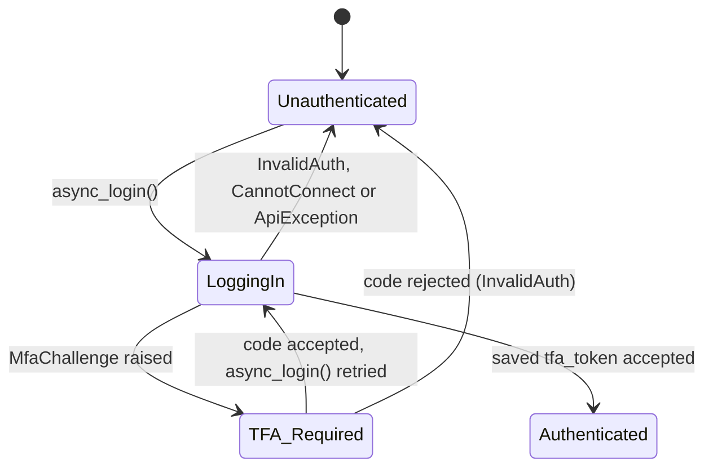
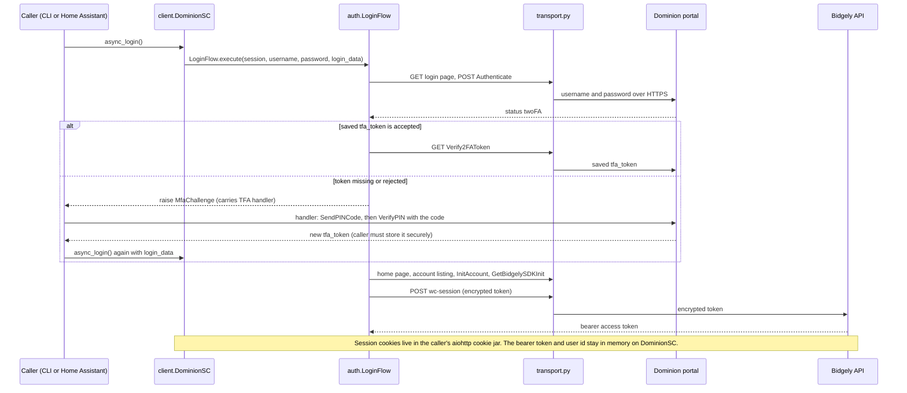
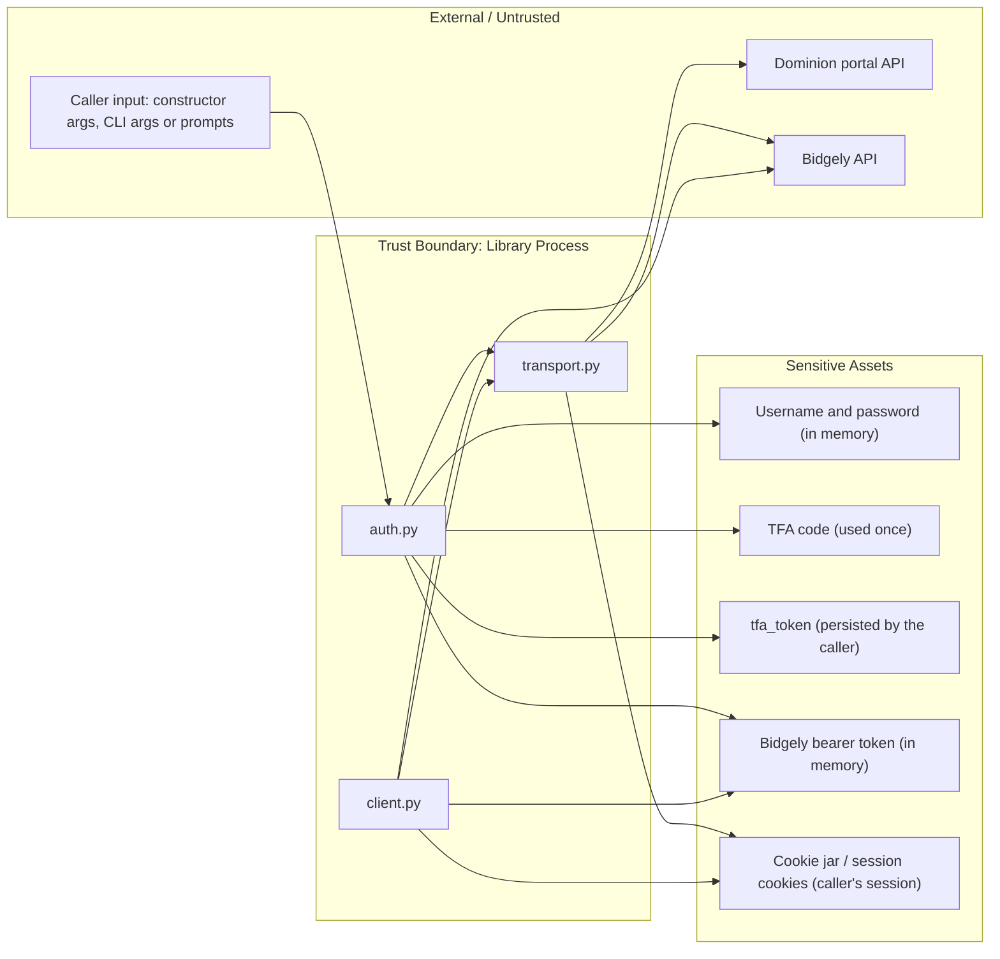

# Security & Authentication Architecture

## Authentication State Machine

The library models login only. It has no token refresh: when a session is no longer valid, the caller calls `async_login()` again.

## Auth Flow Sequence (Security-Focused)

## Security Boundaries & Sensitive Assets

- **Credentials:** the username and password are supplied by the caller (constructor arguments; for the CLI, `--username`/`--password` or interactive prompts, with the password read through `getpass`). `DominionSC` keeps them on the instance for its lifetime and sends them only to the portal's `Authenticate` endpoint. The library does not read credentials from the environment or from files. A `--password` given on the command line is visible in shell history and process listings; omit it to be prompted instead.
- **TFA code:** entered by the user and sent once to `VerifyPIN`; not stored.
- **TFA token (`tfa_token`):** a long-lived value that lets later logins skip interactive TFA. The library returns it to the caller and never persists it. The CLI writes it as plain JSON to `--login_data_file` without changing file permissions; Home Assistant stores it in the config entry. Treat it like a password.
- **Bidgely bearer token and user id:** held in memory on the `DominionSC` instance (`access_token`, `user_id`); never persisted by the library.
- **Session cookies:** managed by the caller's `aiohttp.ClientSession`, which must be created with `create_cookie_jar()` (`helpers.py`, re-exported from the package root) so cookie values are not percent-encoded.
- **Transport:** the default Dominion and Bidgely endpoints in `config.py` are HTTPS.
- **Data at rest:** CSV output contains usage data and the service type; the library does no encryption (consumer responsibility).
- **Exceptions:** the library does not put the password in exception messages, but `InvalidAuth`, `ApiException`, and `CannotConnect` can embed raw API response bodies (`response_text`), which may include a service address or account number. Redact them before logging or sharing.

## Component Security Map

