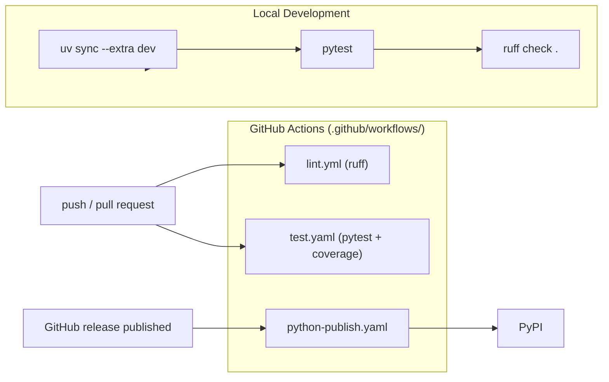
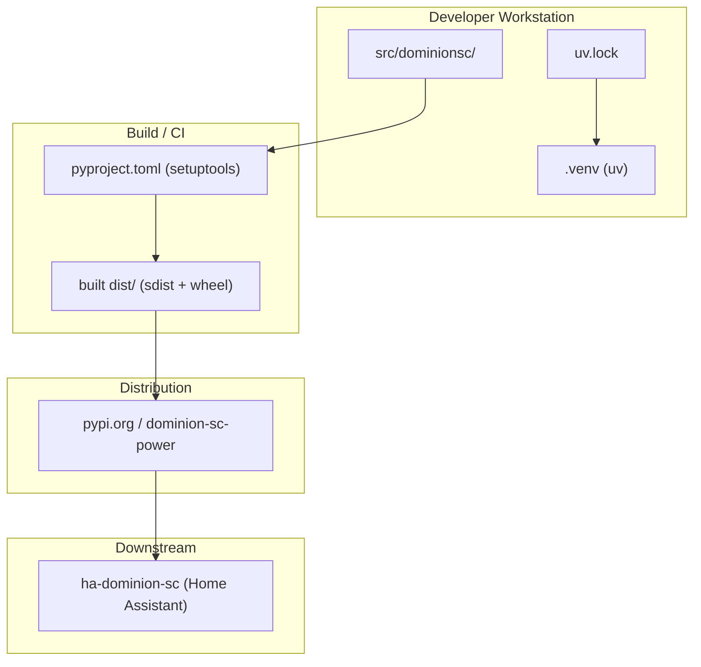

# Deployment & Packaging Architecture

## Build & Package Structure (Grounded)

- `pyproject.toml` — package metadata, runtime dependencies (`aiohttp`, `tzdata`, `xmltodict`), the `dev` optional extra, build-system (`setuptools`), package data (`py.typed`), and tool configs (`ruff`, `pytest`, `mypy`, coverage).
- `uv.lock` — reproducible lockfile (committed).
- `.venv/` — virtualenv managed by `uv`; not committed (`.gitignore`).
- `scripts/setup` — creates or updates `.venv` with `uv sync --extra dev`; `scripts/lint` and `scripts/test` wrap Ruff and pytest.
- `src/dominionsc/` — source layout (not flat).

## CI/CD Pipeline Diagram

## Deployment / Environment Diagram

## Test Strategy (Grounded)

- `tests/` directory present; `pytest` (with `pytest-asyncio` in `auto` mode) is used, with fixtures in `tests/fixtures/`.
- Coverage is reported through `pytest-cov`; the HTML report is written to `htmlcov/`, which is not committed.
- `test.yaml` runs on push and pull request, on Python 3.13.
- `lint.yml` runs `ruff` (lint and format check) on push and pull request, on Python 3.11.
- `python-publish.yaml` builds the distributions and publishes them to PyPI when a GitHub release is published.
- CI installs dependencies with pip; local development uses uv.
