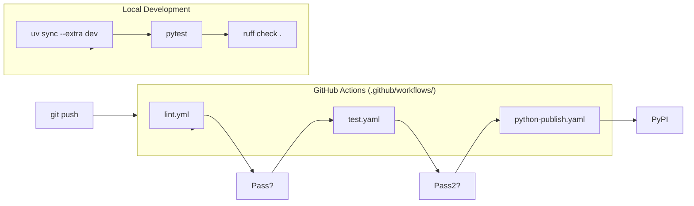
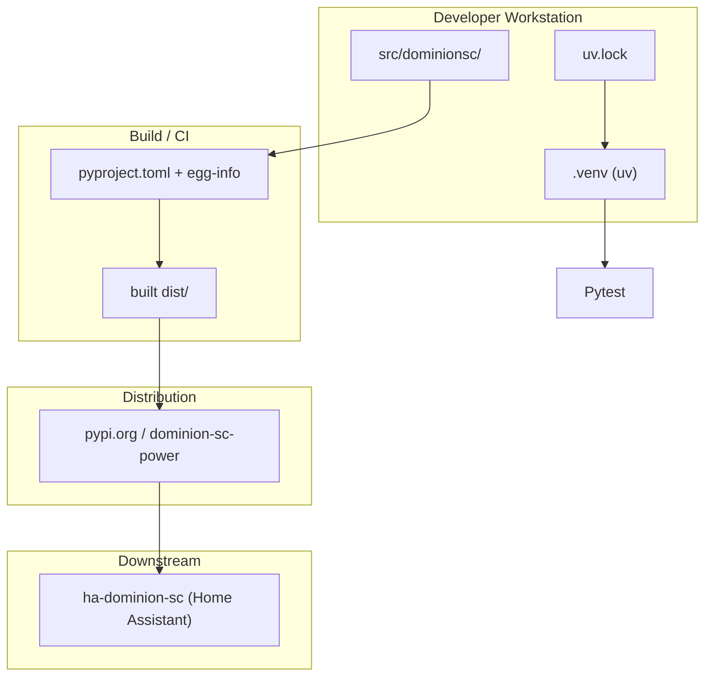

# Deployment & Packaging Architecture

## Build & Package Structure (Grounded)

- `pyproject.toml` — package metadata, dependencies (`aiohttp`, etc.), dev extras, build-system (`setuptools`), tool configs (`ruff`, `pytest`).
- `uv.lock` — reproducible lockfile (27,710 bytes; committed).
- `.venv/` — virtualenv managed by `uv`; not committed (`.gitignore`).
- `scripts/setup` — setup helper.
- `src/dominionsc/` — source layout (not flat).

## CI/CD Pipeline Diagram

## Deployment / Environment Diagram

## Test Strategy (Grounded)

- `tests/` directory present; `pytest` used.
- Coverage reported (`.coverage`, `htmlcov/`).
- `test.yaml` runs on push/PR.
- `lint.yml` runs `ruff`.
